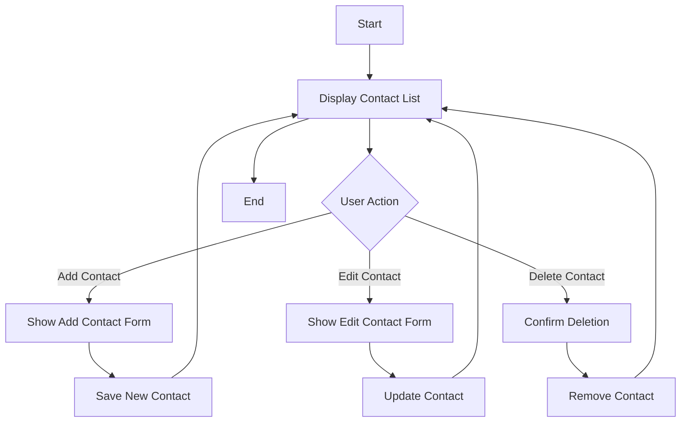

## 📒 Address Book
A simple address book application to store and manage contact information.

## 🔗 Link
- URL Deployment
- [Repository](https://github.com/afiys-as/address-book.git)

## ✨ Features 
- Add, edit, and delete contacts
- Search contacts by name or email

## 🛠️ Tech Stack
- HTML
- CSS
- JavaScript

## 🧭 Flowchart
